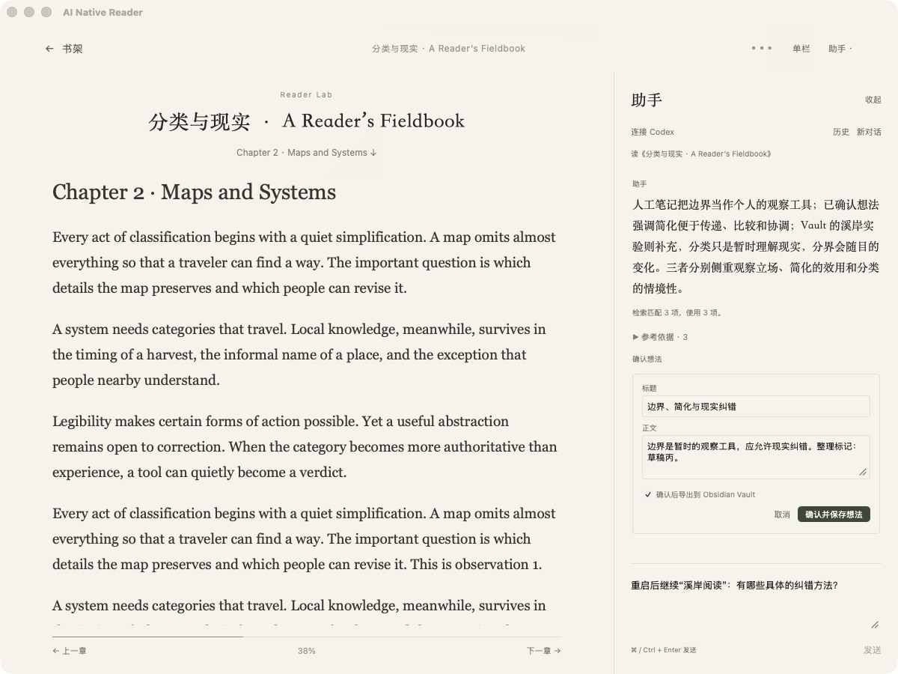

# AI Native Reader


[中文](README.md)

A quiet, local EPUB reader with a persistent reading companion. Read, ask about selected passages, continue a discussion, keep your own words, confirm edited AI drafts, export Markdown, and follow citations back to the book.


*A real Mac app screenshot using the project's original bilingual sample book and an existing acceptance conversation. The screenshots show the Chinese interface; controls are explained below.*

## Features

- EPUB library, table of contents, reading position, highlights and notes.
- Single or double column reading, keyboard navigation and a resizable assistant.
- Local Codex or pi integration using your own configured account. After setup, Reader starts the selected CLI in the background when you connect; no separate Codex desktop app or terminal window needs to remain open.
- Retrieval from Reader notes, confirmed ideas and a connected Obsidian Vault.
- Explicit confirmation before saving AI drafts; Markdown exports with conflict protection.
- Optional local MCP interface for external clients.

## Quick start

1. **Open a book:** import or drag an EPUB onto the library, or choose “先用示例试读” (Try the sample). Switch between single and double columns in the top bar. Use ← / → for chapters and ↑ / ↓ to move within the current chapter.
2. **Discuss a passage:** connect Codex or pi using the [setup guide](docs/GETTING_STARTED.md). Select text and choose “提问” (Ask), or open the right-hand “助手” (Assistant) and type a question. Send with ⌘ / Ctrl + Enter. Expand “原文依据／参考依据” (Sources) and choose “查看原文” (View passage) to jump back to the book.
3. **Keep your thoughts:** choose “存为笔记” (Save as note) on your own message. For an AI response, choose “确认想法” (Review idea), edit the title and text, then “确认并保存想法” (Confirm and save). Connect an Obsidian Vault if you want Markdown exports.

<details>
<summary>More screenshots: double columns and confirming an idea</summary>

### Double column reading


Use “单栏／双栏” (Single / Double) in the top bar. Read the left column, then the right. The page controls or ↑ / ↓ move through the current chapter. The reader temporarily uses one column when space is limited. Collapse the assistant or drag its boundary to adjust its width.

### Review before saving



The result remains an editable draft until you confirm it. This screenshot shows a draft and a test Vault export option from the earlier acceptance run. Ordinary reading does not require a Vault connection.

</details>

## Platform status

The main desktop workflow has been validated on an Apple Silicon Mac with Codex CLI 0.160.0 and pi 1.0.0. Reader accepts Codex CLI 0.159.2 / 0.160.0 / 0.160.1 and pi 1.0.0–1.0.4. The added CLI versions have been reviewed for protocol compatibility; live chat has not been revalidated. See [CLI compatibility](docs/CLI_COMPATIBILITY.md).

Windows and Linux desktop support requires additional development: process discovery, local bridge, data paths and packaging still need adaptation. See [platform status](docs/PLATFORMS.md). Compiling the source does not establish full desktop compatibility.

The browser preview supports EPUB reading and browser-local notes. It has no desktop assistant, Vault access or local MCP. Its data is separate from the desktop database.

### Windows / Linux users

You can use the browser preview by following the [Run](#run) steps below. The Windows local communication bridge is not implemented; Linux data and communication paths need adaptation. Installer targets are not configured for either platform.

Complete desktop build instructions and downloads will be provided after platform adaptation and actual reading workflow acceptance. Contributors can start with the [porting prerequisites](docs/BUILDING.md#windows--linux).

## Download the preview

The latest preview is **v0.1.3**, adding Codex 0.160.1 and pi 1.0.4 compatibility while preserving the app icon and existing conversation bindings. Apple Silicon Mac users can download the app from [GitHub Releases](https://github.com/leoyang1984/ai-native-reader/releases). See [installation and Codex/pi requirements](docs/GETTING_STARTED.md). Codex or pi is optional for ordinary reading; choose one compatible CLI to use the assistant.

## Run

### Browser preview (macOS / Windows / Linux)

Install Git and Node.js 22.12 or later. To obtain the source:

```sh
git clone https://github.com/leoyang1984/ai-native-reader.git
cd ai-native-reader
```

Run from the source directory:

```sh
npm ci
npm run dev
```

Open the local address printed in the terminal, normally `http://127.0.0.1:4173`.

### macOS desktop

Also install Rust stable and Xcode Command Line Tools:

```sh
npm run desktop
```

Build an unsigned Mac application:

```sh
npm run desktop:build
```

Output: `src-tauri/target/release/bundle/macos/AI Native Reader.app`.

Install and authenticate Codex or pi separately to use the assistant. No MCP configuration is needed for conversations inside Reader. See [build instructions](docs/BUILDING.md) and [optional MCP setup](docs/MCP.md).

## Data and scope

The repository includes an original Reader Lab sample, no personal books, notes, database, Vault, credentials or API keys. User data is local, but assistant requests send questions and selected context to the connected model program, which may use a remote provider. See [data handling](docs/PRIVACY.md).

Only DRM-free reflowable EPUB is currently supported. Large Vault retrieval is bounded and may be partial; it is not a complete progressive semantic index. PDF, mobile clients and cross-device sync are not implemented.

## License and future commercial work

Original project code is licensed under [GPL version 3 only](LICENSE) (`GPL-3.0-only`). Commercial use and compliant redistribution are allowed. Third-party components retain their own licenses; see [third-party materials](docs/THIRD_PARTY.md).

We plan to build a useful community first, while exploring paid official services and support later. These plans do not revoke existing GPL rights or require payment for compliant use. See [commercial plans](docs/COMMERCIAL_PLAN.md).
